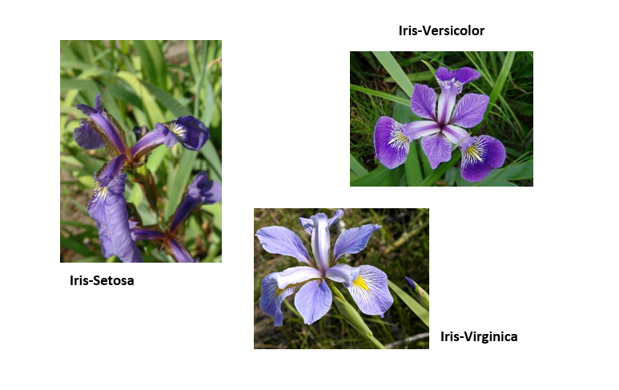
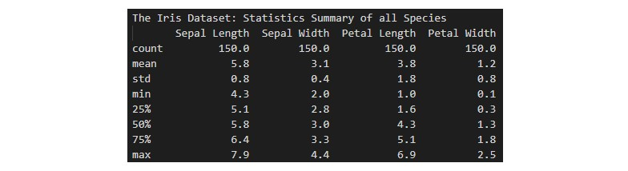
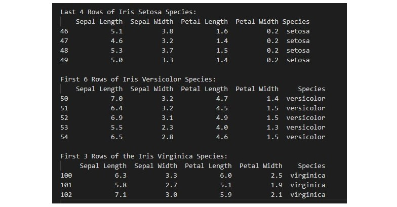
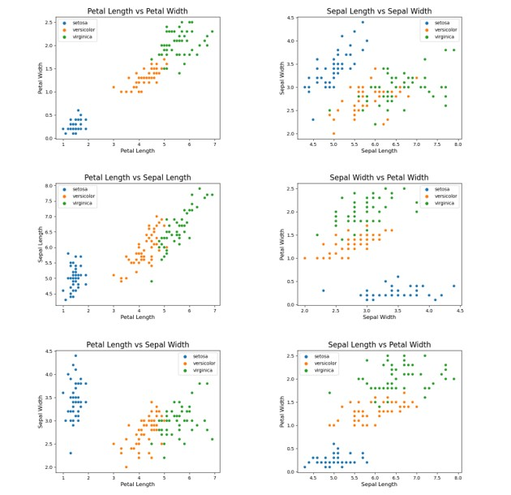
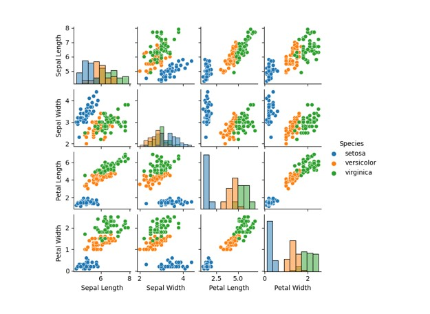

# Programming & Scripting Project: Fisher's Iris Dataset
### by Sarah McNelis

 

## Introduction 
The aim of this project is to research, investigate and analyse Fisher's Iris data set. I have written a program in python to complete this task. I have also included a full list of references and resources used. First let's take a look at the man behind the data set.

 

## Ronald Fisher
Sir Ronald Fisher (17 February 1890 – 29 July 1962) was a British statistician, eugenicist, and biologist. One of his most popular developments was the Iris flower data set also known as Fisher's Iris data set. It is a multivariate data set introduced by Ronald Fisher in his 1936 paper on _The use of multiple measurements in taxonomic problems_ as an example of linear discriminant analysis(LDA). The purpose of LDA as explained by Wikipedia is to portray the difference between classes of data.
#  

 

## Iris Flower Data Set
The dataset contains a set of 150 records under five attributes - Sepal Length, Sepal Width, Petal Length, Petal Width and Species. 
# 
These records are broken down into three species: Iris-Setosa, Iris-Versicolor and Iris-Virginica. Each species contains 50 records each. Therefore, it is not a surprise that this data set became a popular test case for many statistical classification techniques in machine learning such as support vector machines (SVMs). Wikipedia explains that SVMs are supervised learning models with associated learning algorithms that examine data for classification and analysis.

 

## Research & Analysis
- The first step of this project was researching the Iris data set. I downloaded the data set in a csv file format from Kaggle. I then decided to explore the different attributes of the data set. I found some images online which clarify which part of Iris flower is the sepal and which part is the petal. Sepals are usually green and offers support and protection to the petal. However, the sepal of the Iris flower is typically a shade of purple. The role of the petal is to surround and protect the reproductive part of the flower.
# 
- The second step of this project was developing the code. This required importing various modules required to complete the analysis. Numpy and matplotlib are used for plotting the analysis, seaborn is a good tool for visualisation when plotting and pandas is used for analysing the data frame. After this I decided to do a bit of housekeeping. Pydata describes numerous settings that can be changed using pandas. I set the program to only allow one decimal place in the output display; pd.set_option('display.precision', 1). The number refers to the amount of floating points you wish to allow. I have chosen one decimal place as it is neater and easier to read.
- Next I opened the csv file in write mode in order to begin the analysis. w3schools explains the different modes that can be used when opening a file. The 'w' stands for write mode and the 't' refers to text mode as opposed to 'b' for binary. At this point I have also given a name to the file in which I am writing the analysis to; summary.txt. After this, I began investigating the different ways I could analyse this data set. My first discovery was the function describe(). Pydata explains the parameters and purpose of this function. As you can see from the image below, using describe() gives a statistical summary of the data frame in tabular form. These summaries include the count, mean, standard deviation, minimum value, percentiles and maximum values of each attribute. 
# 
- I then used the count() function which Pydata explains will return a series containing counts of unique values. In this program this function has given a count of each of the different species within the data frame. We can also see from this image that the shape of this data frame is reported as (150, 5). This means that the Iris data set consists of 150 rows and 5 columns. Pydata explains that the shape() function will return a tuple containing the dimensionality of the data frame.
# 
- Subsequently, I decided to break down the statistical analysis for each of the three species using the describe() function again. These tables give a brief summary of each species which are also broken down into four columns showing the sepal length, sepal width, petal length and petal width.
# 
- I then decided to select the first five rows form the top of the data frame using the head() function and also the last seven rows from the bottom using the tail() function as suggested by Pydata. Afterward, I discovered that I could not only select the head and tail of the whole data frame but also the three species specifically like I did with the describe function. As you can see in the image below there are numerous ways of breaking down and analysing this data frame. 
# 
- The next step involved plotting this analysis. For this I have chosen to use a def statement when writing the different plots. I decided to do this as it is easier to organise my code and the functions can be easily accessed and used again (VanderPlas 2016, p. 41-42). The two most important factors to remember when using functions are that the local variables contained within the function cannot be called outside of that function and that a function does nothing unless it is called (Sweigart 2015, p. 61-67). Therefore, after creating functions for these plots I have then called them in order for them to run. 
- First, I created a histogram for each of the attributes:  
    1. Sepal Length 
    2. Sepal Width 
    3. Petal Length 
    4. Petal Width 

I have saved these histograms as png files in this repository. Within each of these histograms I choose to break down the results showing each attribute of each species as you can see in the below image. Sharma (2021) explains how to use hue for layered categorisation of histograms in the seaborn module. I have done this by passing in the attribute Species when creating the histograms; hue='Species'. This allows us to analyse each attribute of each species. Sharma (2021) also explains that using the feature 'stack' can allow for better visualization of each category. This is why I also added the parameter; multiple='stack', when creating the histograms. As we can see from this image these features are invaluable in allowing us to analysis the data of each attribute in this data frame. 
# 
- Next step was to create a scatterplot for each pair of variables. For this part of the task, I decided to compare the following attributes:
    1. Petal Length and Petal Width 
    2. Sepal Length and Sepal Width
    3. Petal Length and Sepal Length
    4. Sepal Width and Petal Width
    5. Petal Length and Sepal Width 
    6. Sepal Length and Petal Width  

For each of these plots I have assigned an attribute to the x and y axes. I have also used the hue feature again for the scatterplots. This will give a breakdown of the species when comparing each pair of variables. Similar to the histograms I have used seaborn when creating the scatterplots, as it allows for better visualisation. This makes it easier to compare each pair of variables. I have also saved each of this scatterplots as png files in this repository.
# 
- Finally, the last step of this program was developing another function to create a pairplot for this dataset. Pydata explains that searborn pairplot composes a grid of axes sharing each numeric variable in the data set across the y-axis in a single row and the x-axis across a single column. Again, I have chosen to use the feature hue in order to plot the different species in different colours. This pairplot will automatically form scatterplots and I have also chosen to use a histogram for the diagonal subplots by adding the element; diag_kind='hist'. This can be clearly seen in the below image.  
# 

 

## Conclusion 
After completing the data analysis of Fisher's Iris data set I have determined that there is a wealth of information available on this particular data frame. I used a substantial amount of resources in my research and development of my python program. There are numerous ways that this data set can be analysed and manipulated. I have used various functions to analyse the data set including exploring the shape of the data frame, the count of species present and a brief statistical summary of the data frame and of each species. I have also used both histograms and scatterplots to plot this analysis out. In my opinion, the most noticeable aspect of my analysis is the distinct difference between the Iris-Setosa attributes in comparison to the Iris-Versicolor and the Iris-Virginica. When you consider the pairplot in particular which gives a full overview of the data frame, the Iris-Versicolor and the Iris-Virginica seem to be similar to one another while the Iris-Setosa differs. Nonetheless, all three species are divisible from one another. And this may be another reason that Fisher's Iris data set is so popular amongst researchers in the data analytics.  

 

## References
- _Descriptive or Summary Statistics in Python Pandas - Describe()_, (2021). Datasciencemadesimple. Available at: <<https://www.datasciencemadesimple.com/descriptive-summary-statistics-python-pandas/>> [Accessed April, 2021].
- Fincher, J. _Reading and Writing CSV Files in Python_. Realpython. Available at: <<https://realpython.com/python-csv/#:~:text=Reading%20from%20a%20CSV%20file%20is%20done%20using,does%20the%20heavy%20lifting.%20Here%E2%80%99s%20the%20employee_birthday.txt%20file%3A>> [Accessed April, 2021].
- _Iris.csv_, (2018). Kaggle. Available at: <<https://www.kaggle.com/saurabh00007/iriscsv>> [Accessed April, 2021].
- _Iris flower data set_. Wikipedia. Available at: <<https://en.wikipedia.org/wiki/Iris_flower_data_set>> [Accessed April, 2021].
- _Iris (plant)_. Wikipedia. Available at: <<https://en.wikipedia.org/wiki/Iris_(plant)>> [Accessed April, 2021].
- _Linear discriminant analysis_. Wikipedia. Available at: <<https://en.wikipedia.org/wiki/Linear_discriminant_analysis>> [Accessed April, 2021].
- _Machine learning_. Wikipedia. Available at: <<https://en.wikipedia.org/wiki/Machine_learning>> [Accessed April, 2021].
- _matplotlib.pyplot.scatter()_, (2020). Geeksforgeeks. Available at: <<https://www.geeksforgeeks.org/matplotlib-pyplot-scatter-in-python/>> [Accessed April, 2021].
- _Matplotlib Histograms_. w3schools. Available at: <<https://www.w3schools.com/python/matplotlib_histograms.asp>> [Accessed April, 2021].
- _Matplotlib scatterplot_. Pythonspot. Available at: <<https://pythonspot.com/matplotlib-scatterplot/>> [Accessed April, 2021].
- _Matplotlib Scatter_. w3schools. Available at: <<https://www.w3schools.com/python/matplotlib_scatter.asp>> [Accessed April, 2021].
- O'Leary, N. (2019), _Project-2019_. GitHub. Available at: <<https://github.com/NiamhOL/Project-2019>> [Accessed April, 2021].
- _Options and settings_. Pydata. Available at: <<https://pandas.pydata.org/pandas-docs/stable/user_guide/options.html>> [Accessed April, 2021].
- _pandas.DataFrame.describe_. Pydata. Available at: <<https://pandas.pydata.org/docs/reference/api/pandas.DataFrame.describe.html>> [Accessed April, 2021].
- _pandas.DataFrame.head_. Pydata. Available at: <<https://pandas.pydata.org/pandas-docs/stable/reference/api/pandas.DataFrame.head.html>> [Accessed April, 2021].
- _pandas.DataFrame.shape_. Pydata. Available at: <<https://pandas.pydata.org/pandas-docs/stable/reference/api/pandas.DataFrame.shape.html>> [Accessed April, 2021].
- _pandas.DataFrame.tail_. Pydata. Available at: <<https://pandas.pydata.org/pandas-docs/stable/reference/api/pandas.DataFrame.tail.html>> [Accessed April, 2021].
- _pandas.plotting.scatter matrix_. Pydata. Available at: <<https://pandas.pydata.org/pandas-docs/stable/reference/api/pandas.plotting.scatter_matrix.html>> [Accessed April, 2021].
- _pandas.Series.value counts_. Pydata. Available at: <<https://pandas.pydata.org/pandas-docs/stable/reference/api/pandas.Series.value_counts.html>> [Accessed April, 2021].
- Parker, K. (2020), _Data Analysis in python: Getting started with pandas_. Towardsdatascience. Available at: <<https://towardsdatascience.com/data-analysis-in-python-getting-started-with-pandas-8cbcc1500c83>> [Accessed April, 2021].
- _Petal_. Wikipedia. Available at: <<https://en.wikipedia.org/wiki/Petal>> [Accessed April, 2021].
- _Plotting Histogram in Python using Matplotlib_, (2020). Geeksforgeeks. Available at: <<https://www.geeksforgeeks.org/plotting-histogram-in-python-using-matplotlib/>> [Accessed April, 2021].
- _Python File Open_. w3schools. Available at: <<https://www.w3schools.com/python/python_file_handling.asp>>
- <<https://www.w3schools.com/python/python_functions.asp>> [Accessed April, 2021].
- _Python math Module_. w3schools. Available at: <<https://www.w3schools.com/python/module_math.asp>> [Accessed April, 2021].
- _Reading CSV files in Python_, (2019). Geeksforgeeks. Available at: <<https://www.geeksforgeeks.org/reading-csv-files-in-python/#:~:text=1%20USing%20csv.reader%20%28%29%3A%20At%20first%2C%20the%20CSV,a%20CSV%20file%20using%20pandas%20library%20functions.%20>> [Accessed April, 2021].
- _Ronald Fisher_. Wikipedia. Available at: <<https://en.wikipedia.org/wiki/Ronald_Fisher>> [Accessed April, 2021].
- _seaborn.histplot_. Pydata. Available at: <<https://seaborn.pydata.org/generated/seaborn.histplot.html>> [Accessed April, 2021].
- _seaborn.lmplot_. Pydata. Available at: <<https://seaborn.pydata.org/generated/seaborn.lmplot.html>> [Accessed April, 2021].
- _seaborn.pairplot_. Pydata. Available at: <<https://seaborn.pydata.org/generated/seaborn.pairplot.html>> [Accessed April, 2021].
- _Sepal_. Wikipedia. Available at: <<https://en.wikipedia.org/wiki/Sepal>> [Accessed April, 2021].
- Sharma, P. (2021), _Seaborn Histogram Plot using histplot()_. Machinelearningknowledge. Available at: <<https://machinelearningknowledge.ai/seaborn-histogram-plot-using-histplot-tutorial-for-beginners/>> [Accessed April, 2021].
- Solomon, B. _Pandas GroupBy: Your Guide to Grouping Data in Python_. Realpython. Available at: <<https://realpython.com/pandas-groupby/>> [Accessed April, 2021].
- Solomon, B. _Python Histogram Plotting: NumPy, Matplotlib, Pandas & Seaborn_. Realpython. Available at: <<https://realpython.com/python-histograms/>> [Accessed April, 2021].
- _Support-vector machine_. Wikipedia. Available at: <<https://en.wikipedia.org/wiki/Support-vector_machine>> [Accessed April, 2021].
- Sweigart, A 2015, Automate The Boring Stuff with Python, William Pollock, San Francisco.
- VanderPlas, J 2016, A Whirlwind Tour of Python, O’Reilly Medica Inc, Sebastopol.
- _Visualization_. Pydata. Available at: <<https://pandas.pydata.org/pandas-docs/stable/user_guide/visualization.html >> [Accessed April, 2021].
- Zach (2020), _How to Calculate the Mean of Columns in Pandas_. Statology. Available at: <<https://www.statology.org/mean-of-column-pandas/>> [Accessed April, 2021].

## End